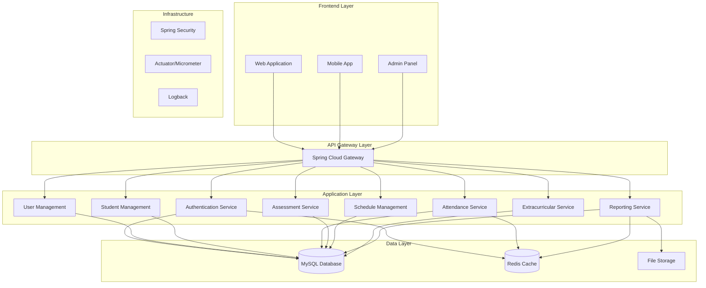
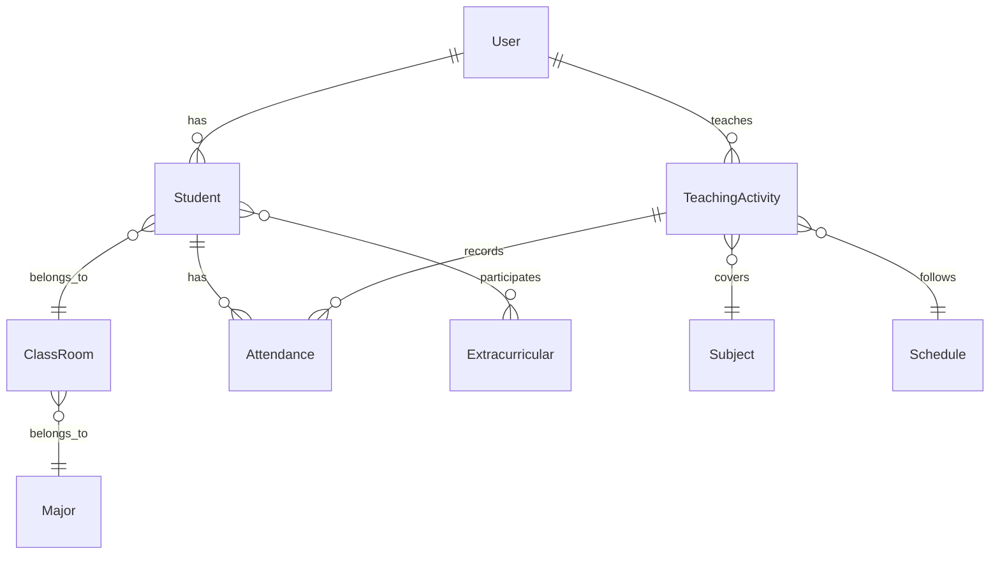

# Design Document

## Overview

This design document outlines the architecture and implementation approach for migrating the School Information Management System (SIM) from PHP Laravel to Spring Boot Maven. The new system will maintain all existing functionality while providing improved performance, scalability, and maintainability through modern Java enterprise patterns and Spring Boot's ecosystem.

The migration will follow a microservices-ready monolithic architecture that can be easily decomposed into microservices in the future. The system will expose RESTful APIs for frontend consumption and maintain backward compatibility during the transition period.

## Architecture

### High-Level Architecture



### Technology Stack

- **Framework**: Spring Boot 3.2+
- **Build Tool**: Maven 3.9+
- **Java Version**: Java 17+
- **Database**: MySQL 8.0+
- **Caching**: Redis 7.0+
- **Security**: Spring Security 6+ with JWT
- **Documentation**: OpenAPI 3 (Swagger)
- **Testing**: JUnit 5, Mockito, TestContainers
- **Monitoring**: Spring Boot Actuator, Micrometer
- **File Processing**: Apache POI for Excel operations
- **Validation**: Bean Validation (JSR-303)

### Package Structure

```
com.school.sim
├── config/                 # Configuration classes
├── controller/             # REST controllers
├── service/               # Business logic services
├── repository/            # Data access layer
├── entity/               # JPA entities
├── dto/                  # Data Transfer Objects
├── mapper/               # Entity-DTO mappers
├── security/             # Security configurations
├── exception/            # Custom exceptions and handlers
├── util/                 # Utility classes
├── validation/           # Custom validators
└── migration/            # Data migration utilities
```

## Components and Interfaces

### Core Entities

#### User Management
```java
@Entity
@Table(name = "users")
public class User {
    @Id
    @GeneratedValue(strategy = GenerationType.IDENTITY)
    private Long id;
    
    @Column(unique = true, nullable = false)
    private String email;
    
    @Column(nullable = false)
    private String name;
    
    @Column(name = "nip", unique = true)
    private String nip; // For teachers
    
    @Column(name = "phone")
    private String phone;
    
    @Enumerated(EnumType.STRING)
    private UserType userType; // ADMIN, TEACHER, STUDENT
    
    @ManyToMany(fetch = FetchType.EAGER)
    @JoinTable(name = "user_roles")
    private Set<Role> roles;
    
    // Additional fields and relationships
}
```

#### Student Management
```java
@Entity
@Table(name = "students")
public class Student {
    @Id
    @GeneratedValue(strategy = GenerationType.IDENTITY)
    private Long id;
    
    @Column(name = "nis", unique = true, nullable = false)
    private String nis;
    
    @Column(name = "nama_lengkap", nullable = false)
    private String namaLengkap;
    
    @OneToOne
    @JoinColumn(name = "user_id")
    private User user;
    
    @ManyToOne
    @JoinColumn(name = "class_room_id")
    private ClassRoom classRoom;
    
    @Enumerated(EnumType.STRING)
    private StudentStatus status; // ACTIVE, INACTIVE, GRADUATED, TRANSFERRED
    
    // Personal information fields
    private String tempatLahir;
    private LocalDate tanggalLahir;
    private String jenisKelamin;
    private String agama;
    private String alamat;
    
    // Relationships
    @OneToMany(mappedBy = "student")
    private List<Attendance> attendances;
    
    @ManyToMany
    @JoinTable(name = "student_extracurricular")
    private Set<Extracurricular> extracurriculars;
}
```

#### Attendance System
```java
@Entity
@Table(name = "attendances")
public class Attendance {
    @Id
    @GeneratedValue(strategy = GenerationType.IDENTITY)
    private Long id;
    
    @ManyToOne
    @JoinColumn(name = "teaching_activity_id")
    private TeachingActivity teachingActivity;
    
    @ManyToOne
    @JoinColumn(name = "student_id")
    private Student student;
    
    @Enumerated(EnumType.STRING)
    private AttendanceStatus status; // PRESENT, LATE, ABSENT, SICK, PERMIT
    
    private String keterangan;
    
    @CreationTimestamp
    private LocalDateTime createdAt;
    
    @UpdateTimestamp
    private LocalDateTime updatedAt;
}
```

### Service Layer Architecture

#### Authentication Service
```java
@Service
@Transactional
public class AuthenticationService {
    
    public AuthenticationResponse authenticate(LoginRequest request) {
        // JWT-based authentication logic
        // Role-based access control
        // Token generation and validation
    }
    
    public void logout(String token) {
        // Token invalidation
        // Cache cleanup
    }
    
    public AuthenticationResponse refreshToken(String refreshToken) {
        // Token refresh logic
    }
}
```

#### Student Management Service
```java
@Service
@Transactional
public class StudentService {
    
    public StudentDto createStudent(CreateStudentRequest request) {
        // Validation and business logic
        // NIS uniqueness check
        // Class capacity validation
    }
    
    public Page<StudentDto> getStudents(StudentSearchCriteria criteria, Pageable pageable) {
        // Advanced search and filtering
        // Pagination support
    }
    
    public void importStudentsFromExcel(MultipartFile file) {
        // Excel processing with Apache POI
        // Batch processing for performance
        // Error reporting and validation
    }
    
    public StudentDto updateStudentStatus(Long studentId, StudentStatus status) {
        // Status change validation
        // Audit trail logging
        // Notification triggers
    }
}
```

#### Attendance Service
```java
@Service
@Transactional
public class AttendanceService {
    
    @Cacheable(value = "attendance", key = "#studentId + '_' + #date")
    public List<AttendanceDto> getAttendanceByDate(Long studentId, LocalDate date) {
        // Cached attendance retrieval
        // Performance optimization
    }
    
    public AttendanceDto recordAttendance(AttendanceRequest request) {
        // Validation logic
        // Duplicate prevention
        // Real-time updates
    }
    
    public void recordBulkAttendance(List<AttendanceRequest> requests) {
        // Batch processing
        // Transaction management
        // Error handling
    }
    
    public AttendanceReportDto generateAttendanceReport(ReportCriteria criteria) {
        // Complex reporting logic
        // Data aggregation
        // Export functionality
    }
}
```

### REST API Design

#### Authentication Endpoints
```java
@RestController
@RequestMapping("/api/v1/auth")
@Validated
public class AuthController {
    
    @PostMapping("/login")
    public ResponseEntity<ApiResponse<AuthenticationResponse>> login(
            @Valid @RequestBody LoginRequest request) {
        // Authentication logic
    }
    
    @PostMapping("/refresh")
    public ResponseEntity<ApiResponse<AuthenticationResponse>> refreshToken(
            @Valid @RequestBody RefreshTokenRequest request) {
        // Token refresh logic
    }
    
    @PostMapping("/logout")
    @PreAuthorize("hasRole('USER')")
    public ResponseEntity<ApiResponse<Void>> logout(
            HttpServletRequest request) {
        // Logout logic
    }
}
```

#### Student Management Endpoints
```java
@RestController
@RequestMapping("/api/v1/students")
@PreAuthorize("hasRole('ADMIN') or hasRole('TEACHER')")
public class StudentController {
    
    @GetMapping
    public ResponseEntity<ApiResponse<Page<StudentDto>>> getStudents(
            @Valid StudentSearchCriteria criteria,
            Pageable pageable) {
        // Student listing with search and pagination
    }
    
    @PostMapping
    @PreAuthorize("hasRole('ADMIN')")
    public ResponseEntity<ApiResponse<StudentDto>> createStudent(
            @Valid @RequestBody CreateStudentRequest request) {
        // Student creation
    }
    
    @PostMapping("/import")
    @PreAuthorize("hasRole('ADMIN')")
    public ResponseEntity<ApiResponse<ImportResultDto>> importStudents(
            @RequestParam("file") MultipartFile file) {
        // Excel import functionality
    }
    
    @GetMapping("/{id}/attendance")
    public ResponseEntity<ApiResponse<List<AttendanceDto>>> getStudentAttendance(
            @PathVariable Long id,
            @RequestParam @DateTimeFormat(iso = DateTimeFormat.ISO.DATE) LocalDate date) {
        // Student attendance retrieval
    }
}
```

### Response Format Standardization

```java
@Data
@Builder
public class ApiResponse<T> {
    private boolean success;
    private String message;
    private T data;
    private List<String> errors;
    private LocalDateTime timestamp;
    private String path;
    
    public static <T> ApiResponse<T> success(T data, String message) {
        return ApiResponse.<T>builder()
                .success(true)
                .message(message)
                .data(data)
                .timestamp(LocalDateTime.now())
                .build();
    }
    
    public static <T> ApiResponse<T> error(String message, List<String> errors) {
        return ApiResponse.<T>builder()
                .success(false)
                .message(message)
                .errors(errors)
                .timestamp(LocalDateTime.now())
                .build();
    }
}
```

## Data Models

### Database Schema Migration Strategy

The migration will maintain the existing MySQL database structure while optimizing indexes and relationships for better performance.

#### Key Entity Relationships



#### Optimized Indexes

```sql
-- Performance optimization indexes
CREATE INDEX idx_attendance_student_date ON attendances(student_id, created_at);
CREATE INDEX idx_teaching_activity_teacher_date ON teaching_activities(teacher_id, date);
CREATE INDEX idx_student_class_status ON students(class_room_id, status);
CREATE INDEX idx_user_email_type ON users(email, user_type);
```

### Data Transfer Objects (DTOs)

```java
// Request DTOs
@Data
@Validated
public class CreateStudentRequest {
    @NotBlank(message = "NIS is required")
    @Size(max = 20, message = "NIS must not exceed 20 characters")
    private String nis;
    
    @NotBlank(message = "Full name is required")
    @Size(max = 100, message = "Name must not exceed 100 characters")
    private String namaLengkap;
    
    @Email(message = "Invalid email format")
    private String email;
    
    @NotNull(message = "Class room is required")
    private Long classRoomId;
    
    // Additional validation annotations
}

// Response DTOs
@Data
@Builder
public class StudentDto {
    private Long id;
    private String nis;
    private String namaLengkap;
    private String email;
    private String phone;
    private ClassRoomDto classRoom;
    private StudentStatus status;
    private LocalDateTime createdAt;
    private LocalDateTime updatedAt;
}
```

## Error Handling

### Global Exception Handler

```java
@RestControllerAdvice
public class GlobalExceptionHandler {
    
    @ExceptionHandler(ValidationException.class)
    public ResponseEntity<ApiResponse<Void>> handleValidationException(
            ValidationException ex, HttpServletRequest request) {
        return ResponseEntity.badRequest()
                .body(ApiResponse.error("Validation failed", 
                      Arrays.asList(ex.getMessage())));
    }
    
    @ExceptionHandler(EntityNotFoundException.class)
    public ResponseEntity<ApiResponse<Void>> handleEntityNotFoundException(
            EntityNotFoundException ex, HttpServletRequest request) {
        return ResponseEntity.status(HttpStatus.NOT_FOUND)
                .body(ApiResponse.error("Resource not found", 
                      Arrays.asList(ex.getMessage())));
    }
    
    @ExceptionHandler(DataIntegrityViolationException.class)
    public ResponseEntity<ApiResponse<Void>> handleDataIntegrityViolation(
            DataIntegrityViolationException ex, HttpServletRequest request) {
        return ResponseEntity.status(HttpStatus.CONFLICT)
                .body(ApiResponse.error("Data integrity violation", 
                      Arrays.asList("Duplicate or invalid data")));
    }
}
```

### Custom Exceptions

```java
@ResponseStatus(HttpStatus.NOT_FOUND)
public class StudentNotFoundException extends RuntimeException {
    public StudentNotFoundException(String nis) {
        super("Student not found with NIS: " + nis);
    }
}

@ResponseStatus(HttpStatus.BAD_REQUEST)
public class AttendanceAlreadyRecordedException extends RuntimeException {
    public AttendanceAlreadyRecordedException(Long studentId, LocalDate date) {
        super("Attendance already recorded for student " + studentId + " on " + date);
    }
}
```

## Testing Strategy

### Unit Testing
- Service layer testing with Mockito
- Repository testing with @DataJpaTest
- Controller testing with @WebMvcTest
- Validation testing for DTOs

### Integration Testing
- Database integration with TestContainers
- API endpoint testing with @SpringBootTest
- Security integration testing
- Cache integration testing

### Test Configuration
```java
@TestConfiguration
public class TestConfig {
    
    @Bean
    @Primary
    public Clock testClock() {
        return Clock.fixed(Instant.parse("2024-01-01T10:00:00Z"), ZoneOffset.UTC);
    }
    
    @TestContainer
    static MySQLContainer<?> mysql = new MySQLContainer<>("mysql:8.0")
            .withDatabaseName("sim_test")
            .withUsername("test")
            .withPassword("test");
}
```

### Performance Testing
- Load testing for attendance recording
- Stress testing for report generation
- Database performance optimization
- Caching effectiveness validation

## Security Implementation

### JWT Authentication
```java
@Component
public class JwtTokenProvider {
    
    public String generateToken(UserDetails userDetails) {
        Map<String, Object> claims = new HashMap<>();
        claims.put("roles", userDetails.getAuthorities());
        return createToken(claims, userDetails.getUsername());
    }
    
    public Boolean validateToken(String token, UserDetails userDetails) {
        final String username = getUsernameFromToken(token);
        return (username.equals(userDetails.getUsername()) && !isTokenExpired(token));
    }
}
```

### Method-Level Security
```java
@Service
public class StudentService {
    
    @PreAuthorize("hasRole('ADMIN') or (hasRole('TEACHER') and @securityService.canAccessStudent(#studentId))")
    public StudentDto getStudent(Long studentId) {
        // Implementation
    }
    
    @PostAuthorize("hasRole('ADMIN') or returnObject.classRoom.teacher.id == authentication.principal.id")
    public StudentDto updateStudent(Long studentId, UpdateStudentRequest request) {
        // Implementation
    }
}
```

### Data Encryption
```java
@Component
public class DataEncryptionService {
    
    @Value("${app.encryption.key}")
    private String encryptionKey;
    
    public String encryptSensitiveData(String data) {
        // AES encryption implementation
    }
    
    public String decryptSensitiveData(String encryptedData) {
        // AES decryption implementation
    }
}
```

This design provides a comprehensive foundation for migrating the Laravel SIM system to Spring Boot while maintaining all existing functionality and improving the overall architecture for better scalability and maintainability.